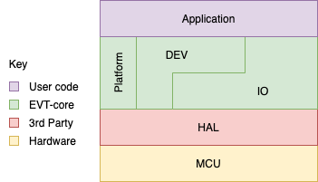

========================
EVT-core Software Design
========================

Conceptual Layers
=================

EVT-core is designed around balance between allowing high level software
development while also giving access to lower level functionality. To help
achieve this goal, the software is divided into layers. Below is a high level
look at the layers that make up EVT-core.

Currently EVT-core is made up of essentially three major components. As
EVT-core continues to grow, more components will be added.

The MCU is the microcontroller itself. Currently EVT-core supports only the
STM32f302x8, in the future we hope to expand to other platforms.

HAL or Hardware Abstraction Layer is generally provided by vendors and
serves as a thin layer between the MCU. This handles individual registers
read/writes that would be handled in a bare metal implementation.

IO handles mainly communication protocols and represents interfacing with
means to move data into and out of the MCU. For example EVT-core supports
I2C, PWM, CAN, and UART as some examples of IO. The IO layer is the main
way in which the MCU communicates with the outside world.

DEV which is short for device represents devices that can be communicated with.
This can include elements as simple as LEDs to more complex circuits such as
BMS chips. DEV is both directly connected to the HAL as well as to the IO
layer intentially. Generally, a device is connected to a MCU via some
communication protocol and as such the device is built ontop of the IO layer.
For example, a temperature sensor which would be a device in EVT-core may
be connected via I2C to the MCU. Some devices however are built directly into
the MCU. For example, the STM32f302x8 has an internal watchdog. In that case,
implementing the watchdog requires direct access to the HAL.

Platform represents MCU specific operations that do not directly lie within
the IO or DEV layer. A good example is clock configuration that needs to
take place for the STM32f302x8. Another example would be the ability to
have the MCU enter a "lower power mode". Such functionality doesn't strictly
belong in the IO or DEV layer.

Implementation of Concept
=========================

In general the file structure of EVT-core is meant to reflect the layers
above. For example, within `EVT-core/include/EVT/` you will see the
folders directly lineup with the layers mentioned above. Within the subfolders
you will then find the platform specific implementions. So for example,
`EVT-core/include/EVT/io/CAN.hpp` will contain the platform independent
functionality of CAN. `EVT-core/include/EVT/io/platform/` will then contain
the implementations for each supported platform.

The implementation is done via OOP. Inheritance is used to easily define
platform independent functionality then implement that functionality for
each platform. For example, there is a class `ADC` which is then extended
to make the STM32f302x8 implementation of the ADC.
